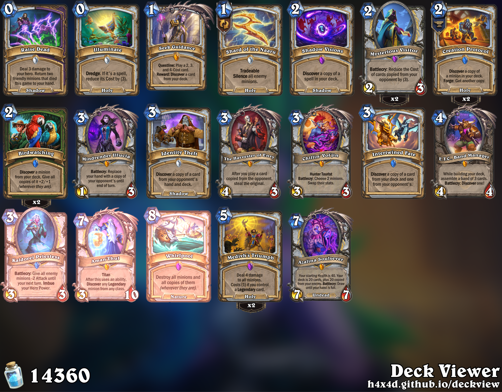

# Deckview

Deckview turns Hearthstone deck codes into images and can run on VK, Telegram,
Discord.



Invite links: [hextract.github.io/deckview](https://hextract.github.io/deckview)

## Configuration

Create the environment file once:

```bash
cp .env-example .env
```

Battle.net credentials are always required:

```dotenv
CLIENT_ID=YOUR_CLIENT_ID
CLIENT_SECRET=YOUR_CLIENT_SECRET
```

Add the token for each platform you plan to run:

```dotenv
VK_TOKEN=YOUR_VK_TOKEN
TELEGRAM_TOKEN=YOUR_TELEGRAM_TOKEN
DISCORD_TOKEN=YOUR_DISCORD_TOKEN
```

Discord starts without privileged intents and supports the `/deck` and `/code`
slash commands. To also detect deck codes in ordinary messages and enable the
text-prefix command, turn on **Message Content Intent** under **Bot → Privileged
Gateway Intents** in the Discord developer portal, then set:

```dotenv
DISCORD_MESSAGE_CONTENT_INTENT=true
```

Set `DECKVIEW_CACHE_DIR` to a persistent writable directory in production if
the card-image cache should survive operating-system temporary-file cleanup.

## Install and run one platform

Discord:

```bash
uv sync --extra ds
uv run --extra ds deckview ds
```

VK:

```bash
uv sync --extra vk
uv run --extra vk deckview vk
```

Telegram:

```bash
uv sync --extra tg
uv run --extra tg deckview tg
```

`uv sync` performs an exact synchronization. Switching from `--extra vk` to
`--extra tg`, for example, removes the VK-only packages from `.venv`.

## Run multiple platforms

Install and start selected platforms:

```bash
uv sync --extra vk --extra tg
uv run --extra vk --extra tg deckview vk tg
```

Install and start everything:

```bash
uv sync --all-extras
uv run --all-extras deckview all
```

The long platform names `telegram` and `discord` are also accepted.

## Activate the environment

Activation is optional with uv. To activate it on macOS or Linux:

```bash
source .venv/bin/activate
deckview vk
```

Use `deactivate` to leave the environment.

## Tests

```bash
uv sync --all-extras
uv run --all-extras python -m unittest discover -s tests -v
```
